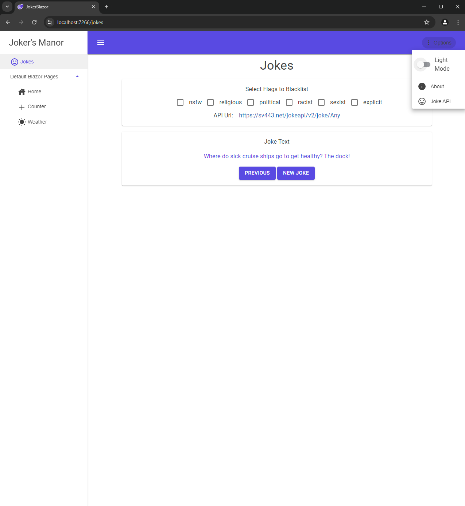

# JokerBlazor

This is a Blazor Web Application project called JokerBlazor. It is built using the Blazor framework, which allows you to build interactive web applications using C# instead of JavaScript.

## Getting Started

To get started with JokerBlazor, follow these steps:

1. Install the .NET SDK: You will need to have the .NET SDK installed on your machine.
   - You can download it from [here](https://dotnet.microsoft.com/en-us/download).
2. Fork and Clone the repository: `git clone https://github.com/your-username/JokerBlazor.git`
   - Update this command with your GitHub username after forking the repository.
3. Navigate to the project directory: `cd JokerBlazor`
4. Open the project in Visual Studio: `explorer JokerBlazor.sln`
   - To open the project in Visual Studio from the Terminal.
   - You can also open the project solution file directly from Visual Studio.
5. Build the project: `clt + shift + 'b'`
   - Keyboard shortcut to build the project in Visual Studio
6. Run the application: `Green play button in Visual Studio`
7. Open your web browser and navigate to the corresponding `applicationUrl`
   - Within `JokerBlazor/Properties/launchSettings.json`, based on project startup launch profile, to see the application in action.

## Features

JokerBlazor has the following features:

- Interactive user interface built with Blazor components.
- Server-side rendering for fast initial page load.
- Real-time updates using SignalR.
- CRUD operations with a backend API.

## Pictures

## Technologies Used

- Blazor: A framework for building interactive web applications using C#.
- C#: A programming language used for developing various applications.
- HTML: A markup language used for structuring web pages.
- CSS: A style sheet language used for describing the look and formatting of a document written in HTML.
- JavaScript: A programming language used for adding interactivity to web pages.
- ASP.NET Core: A cross-platform framework for building modern, cloud-based, internet-connected applications.

## Package References

JokerBlazor uses the following packages:

- [MudBlazor](https://www.nuget.org/packages/MudBlazor) (Version 7.8.0)
- [Newtonsoft.Json](https://www.nuget.org/packages/Newtonsoft.Json) (Version 13.0.3)
- [Serilog](https://www.nuget.org/packages/Serilog) (Version 4.0.1)
- [Serilog.AspNetCore](https://www.nuget.org/packages/Serilog.AspNetCore) (Version 8.0.2)
- [Serilog.Settings.Configuration](https://www.nuget.org/packages/Serilog.Settings.Configuration) (Version 8.0.2)
- [Serilog.Sinks.Console](https://www.nuget.org/packages/Serilog.Sinks.Console) (Version 6.0.0)
- [Serilog.Sinks.File](https://www.nuget.org/packages/Serilog.Sinks.File) (Version 6.0.0)

## JokeAPI Integration

JokerBlazor incorporates the [JokeAPI](https://v2.jokeapi.dev/) to provide jokes and humor to the users. The JokeAPI is a free and open API that offers a wide range of joke categories and types. It can be accessed through HTTP requests and provides JSON responses containing various joke details such as the joke category, type, setup, and punchline. The integration with JokeAPI adds an extra layer of fun and entertainment to the JokerBlazor application.

## Contributing

Contributions are welcome! If you have any ideas, suggestions, or bug reports, please open an issue or submit a pull request.

## Acknowledgements

- [Blazor](https://dotnet.microsoft.com/apps/aspnet/web-apps/blazor): A framework for building interactive web applications using C#.
- [ASP.NET Core](https://dotnet.microsoft.com/apps/aspnet): A cross-platform framework for building modern, cloud-based, internet-connected applications.
- [SignalR](https://dotnet.microsoft.com/apps/aspnet/signalr): A library for adding real-time web functionality to applications.
